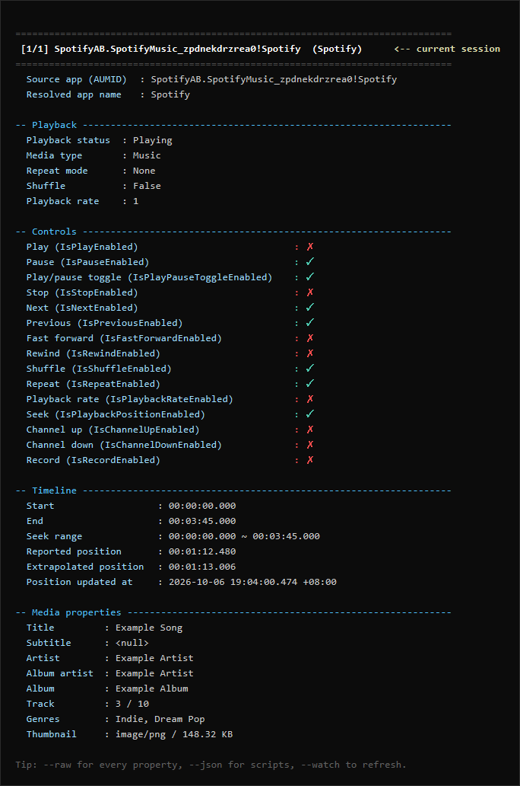

# SMTC Reader

[English](README.md) | 简体中文

一个 Windows 命令行工具，输出应用程序通过 SMTC（System Media Transport Controls，
系统媒体传输控件）发布的全部数据。SMTC 是系统媒体面板与键盘媒体键所依赖的接口。适用于
诊断依赖当前播放内容的集成场景：可查看应用设置了哪些字段、哪些字段为空、哪些从未上报。



*上图为 [docs/sample-report.md](docs/sample-report.md) 中示例会话的实际输出。名称为
虚构，排版未作修改。*

## 环境要求

Windows 10 1809（build 17763）或更高版本，或 Windows 11。Release 中的可执行文件为
自包含版本；自行构建需要 .NET SDK 10.0 或更高版本。

## 用法

```powershell
smtc-reader.exe                             # 全部会话，完整报告
smtc-reader.exe --list --watch              # 概览，持续刷新
smtc-reader.exe --app potplayer -t art.png  # 指定应用并导出封面
smtc-reader.exe --json > sessions.json      # 供程序读取
```

每次运行还会在可执行文件所在目录写入一份 Markdown 报告，文件名以采集时间命名
（`smtc-20261006-190401.md`）。示例见 [docs/sample-report.md](docs/sample-report.md)。

## 命令行参数

| 参数 | 说明 |
| --- | --- |
| `-a`、`--app <关键词>` | 仅输出 AUMID 或应用显示名匹配的会话。`*` 为通配符，不含通配符时按子串匹配。 |
| `-l`、`--list` | 仅打印概览表。 |
| `-w`、`--watch` | 持续刷新，Ctrl+C 中断。 |
| `-i`、`--interval <秒>` | 刷新间隔，默认 `1.0`。 |
| `-n`、`--count <次数>` | 刷新指定次数后停止，`0` 表示运行至 Ctrl+C。 |
| `-t`、`--thumbnail <路径>` | 导出封面。多会话时文件名附加序号与 AUMID。 |
| `--out-dir <目录>` | 报告输出目录，默认为可执行文件所在目录。 |
| `--no-markdown` | 不写入报告。 |
| `--raw` | 附加每个属性的反射转储。 |
| `-j`、`--json` | 标准输出改为 JSON，状态信息写入标准错误。 |
| `--lang <auto\|en\|zh>` | 输出语言，默认 `auto`。 |
| `-h`、`--help`、`--version` | 用法与版本。 |

退出码：`0` 成功（包括未检测到会话），`1` 运行失败，`2` 命令行参数错误。

## 说明

- `应用上报进度` 是应用在 `LastUpdatedTime` 时刻发布的位置，并非持续递增的时钟。
  `按上报时间外推` 会补上经过的时间并收敛到可拖动范围内；若应用从不更新时间戳，则不做外推。
- `<null>` 表示属性从未被设置；`<empty>` 表示被设置为空字符串。
- 封面扩展名依据文件头判断，而非应用声称的内容类型。
- 一个应用可能拥有多个会话，`★` 标记 Windows 将媒体键路由到的那个会话。

逐字段说明见 [docs/fields.md](docs/fields.md)。JSON 使用 `TimeSpan` 标准往返格式与
ISO 8601 时间戳，不包含封面字节。

## 构建与测试

```powershell
dotnet build -c Release
dotnet test  -c Release
dotnet publish src/SmtcReader -c Release -r win-x64 --self-contained true `
    -p:PublishSingleFile=true -o artifacts
```

58 个测试。发布产出的可执行文件约 95 MB，因为采用自包含部署；裁剪被关闭，原因是原始数据
报告通过反射枚举 WinRT 属性。WinRT 互操作仅存在于
`src/SmtcReader/Smtc/WinRtSessionSource.cs`，渲染器均为基于快照的纯函数。

## 许可

[MIT](LICENSE)。提交改动前请阅读 [CONTRIBUTING.md](CONTRIBUTING.md)。
